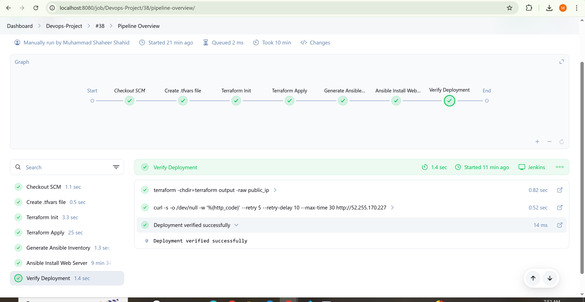
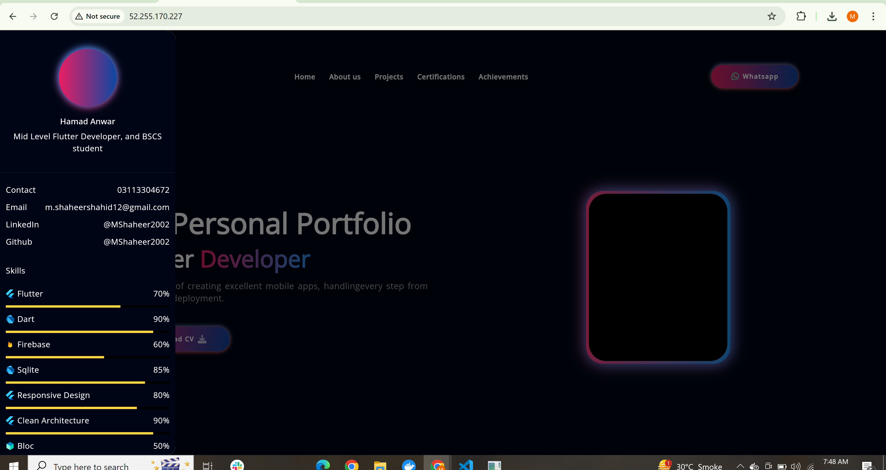
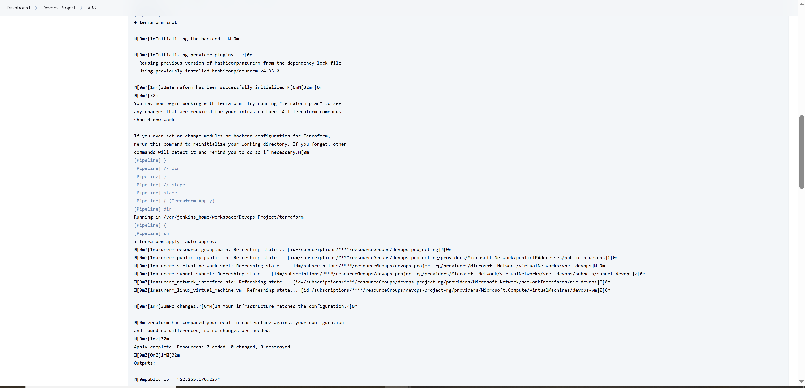
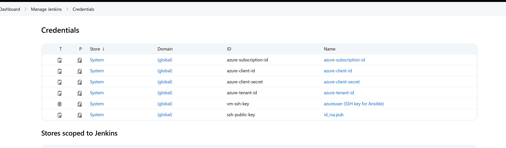

# DevOps Final Project: CI/CD Pipeline with Jenkins, Terraform, Ansible, and Azure

This project automates the deployment of a **Flutter Web Application** to an **Azure Virtual Machine** using a fully integrated DevOps pipeline. The CI/CD workflow is powered by **Jenkins**, with **Terraform** for infrastructure provisioning and **Ansible** for server configuration.

---

## Tech Stack

| Layer               | Technology              |
|--------------------|-------------------------|
| CI/CD Pipeline      | Jenkins (Dockerized)    |
| Infrastructure as Code | Terraform + Azure     |
| Configuration Management | Ansible             |
| Cloud Provider       | Microsoft Azure         |
| Frontend             | Flutter Web App         |
| App Server           | Apache2                 |

---

## Project Structure

```
Devops-Project/
├── Jenkinsfile
├── terraform/
│   ├── main.tf
│   ├── variables.tf
│   └──terraform.tfvars [not uploaded to github]
├── ansible/
│   └── install_web.yml
├── screenshots/
│   └── <include all screen shots>
├── .gitignore
├──  README.md
└── app/
    └── <build of flutter web app>


```

---

## Pipeline Stages

1. **SCM Checkout** – Jenkins pulls the latest code from GitHub.
2. **Secrets & Keys** – Loads SSH keys and Azure credentials securely.
3. **Terraform Init & Apply** – Provisions the VM, VNet, NIC, and Public IP.
4. **Generate Ansible Inventory** – Extracts public IP of the VM and writes inventory file.
5. **Ansible Playbook Execution** – Installs Apache2 and deploys the Flutter Web app.
6. **Deployment Verification** – Curl request checks the web server is live.

---

## Deployment URL

**[http://52.255.170.227](http://52.255.170.227)**  
> Hosted on Azure VM via Apache2

---

## How to Run

> Prerequisites: Docker, Git, Terraform CLI, Ansible CLI, Jenkins (Docker), Azure account

1. **Clone the repo**
```bash
git clone https://github.com/MShaheer2002/Devops-Project.git
cd Devops-Project
```

2. **Start Jenkins with Docker**
```bash
docker run -d --name jenkins \
  -p 8080:8080 -p 50000:50000 \
  -v jenkins_home:/var/jenkins_home \
  -v /var/run/docker.sock:/var/run/docker.sock \
  -v $(which terraform):/usr/local/bin/terraform \
  -v $(which ansible-playbook):/usr/local/bin/ansible-playbook \
  jenkins/jenkins:lts
```

3. **Configure Jenkins Job**
   - Use pipeline from SCM: GitHub repo
   - Add credentials:
     - Azure Service Principal (ARM credentials)
     - SSH private key
   - Trigger build

---

## Security

- Credentials are injected using Jenkins' Credentials Manager
- SSH private keys are protected with proper file permissions
- Azure resources are scoped to a dedicated Resource Group

---

## Screenshots

1. Jenkins working pipeline screenshot


2. Deployed Flutter Web App screeenshot


3. Terraform init and apply console output


4. Apache2 Install and webapp pushed


5. Jenkins Credentails that are used overview



---

## Author

**Muhammad Shaheer Shahid**  
Email: `bscs2112351@gmail.com`  
GitHub: [MShaheer2002](https://github.com/MShaheer2002)

---

## Final Notes

This project demonstrates:
- Infrastructure as Code (IaC) with Terraform  
- Automated configuration and deployment with Ansible  
- CI/CD automation with Jenkins  
- Cloud deployment on Microsoft Azure  
- Production-ready Flutter Web App hosting
